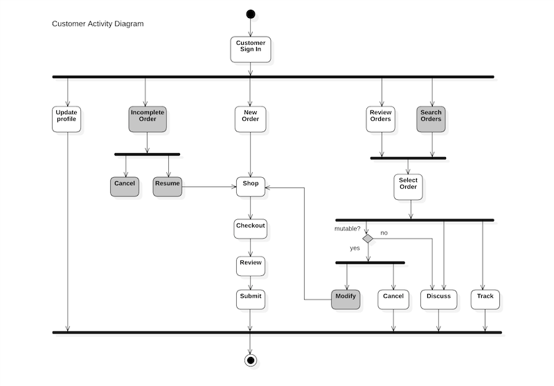
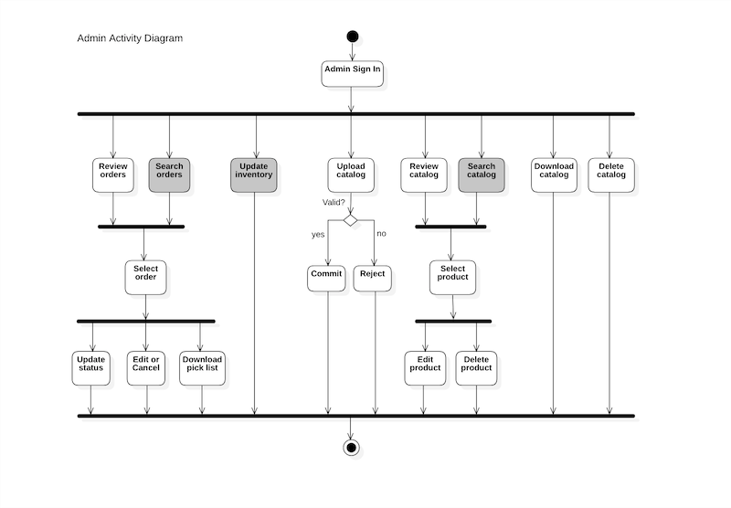

# greenleaves

## Deployed [Demo](https://greenleaves-deployed.herokuapp.com/)

Greenleaves is a business-to-business (B2B) fullstack web application enabling customers to place orders with an Asian vegetable wholesaler for pickup or delivery.  Orders may be placed in the following languages:

* English
* Vietnamese
* Korean
* Chinese (Simplified)

Additionally, the application allows an administrator to upload and edit the product catalog.

## Technology Stack

### Frontend

* React with Material Design UI
* Internationalization with react-i18next
* Javascript
* HTML
* CSS

### Backend

* RESTful API
* Javascript
* NodeJS
* ExpressJS web server
* Sequelize ORM
* MySQL
* Authentication with Auth0
* Internationalization with i18next

### Testing

Unit and Integration tests in Jest.

## Design

### Customer Activity Diagram

Disclaimer: 

I'm abusing the UML notation a bit since the fork and join symbols imply processes that run in parallel, whereas I'm using them to describe alternate task-flows for customer and admin users.  My apologies to thousand UML gods in the sky.

### Administrator Activity Diagram

### Data Design (Entity Relationship Diagram)

## Routes

### API Routes

### Web client routes
